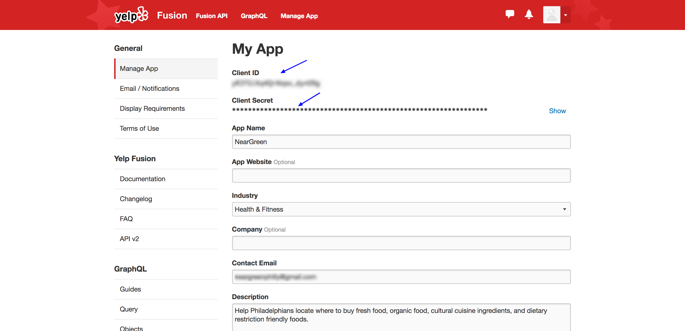
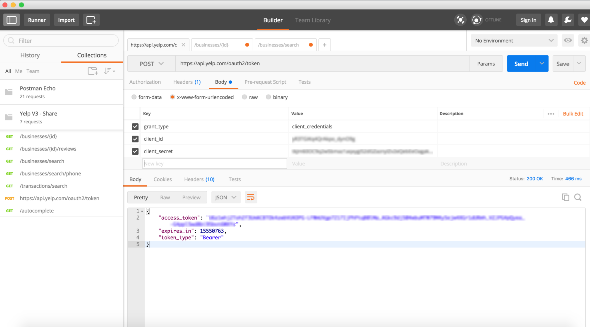

# Yelp Fusion
## How-To

### I. Acquiring your authentication token
1. Get your app's Client ID and Client Secret
    - 
2. Open up a REST Client such as Postman (http://www.getpostman.com/)
3. Create a POST request with the following
    - URL
        - *https://api.yelp.com/oauth2/token*
    - Application Type
        - *x-www-form-urlencoded*
    - Keys in the request body
        - *grant_type*
        - *client_id*
        - *client_secret*
    - 
4. After you send the POST Request, see the value in the body for the key *access_token*.
    - - 
