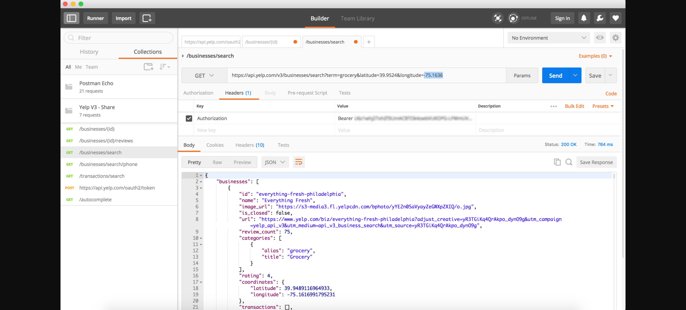

# Yelp Fusion
## How-To

### I. Acquiring your authentication token
1. Get your app's Client ID and Client Secret
    - 
2. Open up a REST Client such as Postman (http://www.getpostman.com/)
3. Create a POST request with the following
    - URL
        - *https://api.yelp.com/oauth2/token*
    - Application Type
        - *x-www-form-urlencoded*
    - Keys in the request body
        - *grant_type*
        - *client_id*
        - *client_secret*
    - 
4. After you send the POST Request, see the value in the body for the key *access_token*.
    - 

### II. Search for a specifc type of place
1. Create a GET Request with the following
    - URL
        - *https://api.yelp.com/v3/businesses/search?term=grocery&latitude=39.9524&longitude=-75.1636*
            - Parameters (after the *?*)
                - *term*
                    - eg. *Supermarket*, *Grocery*, *Halal*, ...
                - *latitude*
                    - eg. *39.9524*
                - *longitude*
                    - eg. *-75.1636*
    - Headers
        - Key-Value Combination
            - Key
                - *Authorization*
            - Value
                - *Bearer **your_authoriztion_token***
    - 
2. Find the properties of interest on the response message.
    - Ex.
        - *name*
        - *coordinates*
            - *latitude*
            - *longitude*
        - *location*
            - *address1*
            - *address2*
            - *address3*
            - *zip_code*
        - *display_phone*